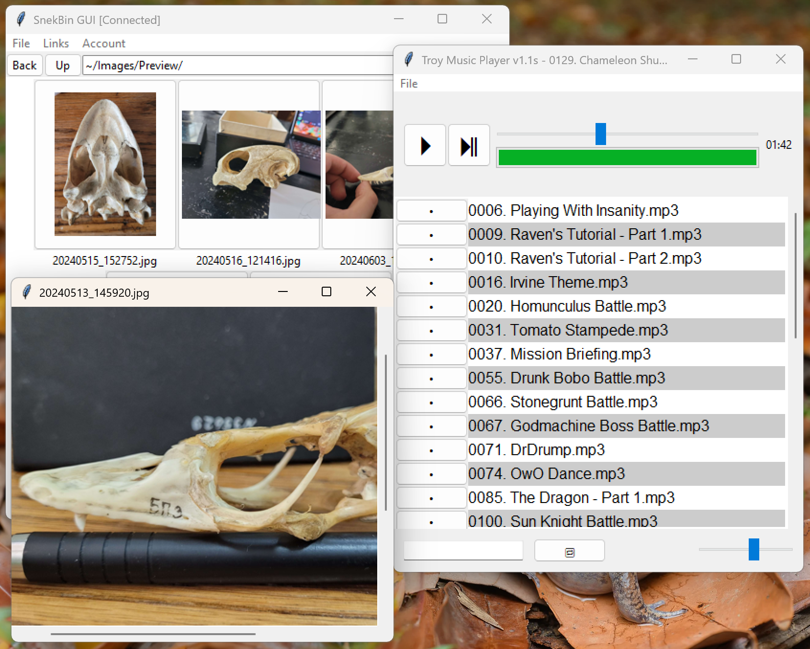

# Overview
**Snekbin** is a cloud storage program written in Python, it is split into its server (`snekbin.py`) and client (`snekbingui.py`).

List of features:
- lightweight tkinter-based client
- custom database architecture based on built-in Python libraries
- embedded music player
- embedded image viewer
- drag and drop files into the main window
- Ctrl+C and Ctrl+V shortcuts for uploading files
- account system with password hashes (do not expose server logs, only expose Snekbin to the Internet via HTTPS)
- file search via Ctrl+F shortcut
- file sharing via generated links